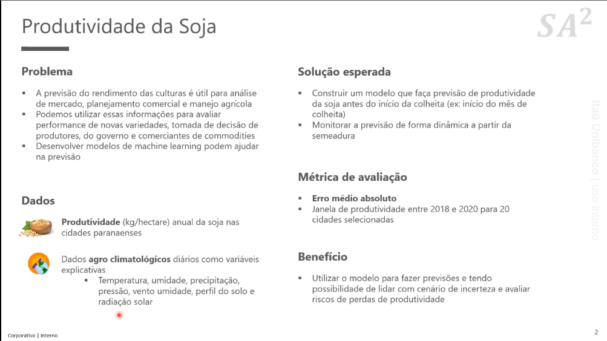

# Hackaton - Batalha de dados - Edição Budokai

## Sobre o desafio: 
### Consistiu em prever a produtividade de soja, do ano de 2018, 2019 e 2020, para 20 municipios do estado do Paraná.
### A partir de um banco de dados, fornecido pela Nasa, contendo os dados de clima (temperatura, umidade e ensolação) diaria para cada municipio, dos anos de 2013 até 2020, e um banco de dados com a produtividade anual dos anos de 2014 até 2017.

### - Então basicamente precisavamos achar uma maneira de correlacionar os dados de clima diário com a produtividade anual de cada região;
### - Achar um modelo que melhor se encaixasse nos dados (tinha uma chance grande de overfitar);
### - Prever com o menor erro possivel os 3 ultimos anos (erro médio absoluto - escolhido pela staff do hackaton).

## Sobre as soluções:
### Foi uma expêriencia enriquecedora, toda a jornada do hackaton foi muito desafiadora pra mim, cemeçamos tendo diversos desafios em relação a reorganização dos dados e nosso primeiro e maior desafio foi correlacionar os dados diários com os dados anuais de forma que não perdessemos a qualidade das informações, partimos calculando as médias anuais mas os dados perderam muita informação então resolvermos utilizar, pra cada ano, a média mensal dos dados de clima e reorganizando o dataset conseguimos colocar os dados mês a mês em uma unica linha para cada ano.
### Sobre o modelo, entendemos que cada região está disposta de forma única e produz uma quantidade diferente dado os mesmos dados de clima, então resolvemos utilizar um modelo para cada municipio, no qual foi treinado, com os dados de clima e produtividade, e depois fez as previsões dos anos que queriamos.
### Inicialmente utilizamos um modelo simples de Lasso, calculando encima dos dados, os melhores parametros para ele.
### Nas versões seguintes fizemos uma pipeline para testar vários modelos diferentes e relacionar seus desempenhos, chegamos a melhores resultados utilizando SVC (com kernel polynomial), gradient boost e decision tree.

## Dividimos os notebooks em 5 versões, no qual tentamos melhorar o código em áreas especifias em cada versão nova.

### V1- Dados por média anual e implementação do Lasso para ver a importancia das features.

### V2- Dados anuais concatenados por médias mensais (media_mensal1, media_mensal2 ...).

### V3- Implementamos uma pipeline para testar diversos modelos. (versão Principal)

### V4- Versão de testes, para melhoramento da V3, trouxe a medida da media do erro absoluto para a feature de 2017.

### V5- Versão de testes, restringindo os dados para os meses de plantio e colheita (11,12,1,2,3,4).

##Nota:
### Os resultados esperados não foram tão satisfatorios como queriamos, mas se dedicamos bastante.
### Tivemos alguns atrasos em relação a concatenação dos dados e acabamos por ficar sem tempo para um ajuste melhor do modelo escolhido.
### Mas a experiencia do evento foi sensacional e agradecemos muito por estarmos aqui entre as 35 equipes selecionadas!

#### Hackaton Budokai

⣿⣿⠿⠿⠿⠿⣿⣷⣂⠄⠄⠄⠄⠄⠄⠈⢷⣿⣿⣿⣿⣿⣿⣿⣿⣿⣿⣿⣿⣿⣿
⣷⡾⠯⠉⠉⠉⠉⠚⠑⠄⡀⠄⠄⠄⠄⠄⠈⠻⠿⣿⣿⣿⣿⣿⣿⣿⣿⣿⣿⣿⣿ 
⠄⠄⠄⠄⠄⠄⠄⠄⠄⠄⠄⡀⠄⠄⠄⠄⠄⠄⠄⠄⠉⠻⣿⣿⣿⣿⣿⣿⣿⣿⣿ 
⠄⠄⠄⠄⠄⠄⠄⠄⠄⢀⠎⠄⠄⣀⡀⠄⠄⠄⠄⠄⠄⠄⠘⠋⠉⠉⠉⠉⠭⠿⣿
⡀⠄⠄⠄⠄⠄⠄⠄⠄⡇⠄⣠⣾⣳⠁⠄⠄⢺⡆⠄⠄⠄⠄⠄⠄⠄⠄⠄⠄⠄⠄
⣿⣷⡦⠄⠄⠄⠄⠄⢠⠃⢰⣿⣯⣿⡁⢔⡒⣶⣯⡄⢀⢄⡄⠄⠄⠄⠄⠄⣀⣤⣶
⠓⠄⠄⠄⠄⠄⠸⠄⢀⣤⢘⣿⣿⣷⣷⣿⠛⣾⣿⣿⣆⠾⣷⠄⠄⠄⠄⢀⣀⣼⣿
⠄⠄⠄⠄⠄⠄⠄⠑⢘⣿⢰⡟⣿⣿⣷⣫⣭⣿⣾⣿⣿⣴⠏⠄⠄⢀⣺⣿⣿⣿⣿ 
⣿⣿⣿⣿⣷⠶⠄⠄⠄⠹⣮⣹⡘⠛⠿⣫⣾⣿⣿⣿⡇⠑⢤⣶⣿⣿⣿⣿⣿⣿⣿
⣿⣿⣿⣯⣤⣤⣤⣤⣀⣀⡹⣿⣿⣷⣯⣽⣿⣿⡿⣋⣴⡀⠈⣿⣿⣿⣿⣿⣿⣿⣿
⣿⣿⣿⣿⣿⣿⣿⣿⣿⣿⣿⣾⣝⡻⢿⣿⡿⠋⡒⣾⣿⣧⢰⢿⣿⣿⣿⣿⣿⣿⣿
⣿⣿⣿⣿⣿⣿⣿⣿⣿⣿⣿⣿⡿⠃⣏⣟⣼⢋⡾⣿⣿⣿⣘⣔⠙⠿⠿⠿⣿⣿⣿
⣿⣿⣿⣿⣿⣿⣿⣿⣿⠿⠿⣛⡵⣻⠿⠟⠁⠛⠰⠿⢿⠿⡛⠉⠄⠄⢀⠄⠉⠉⢉ 
⣿⣿⣿⣿⡿⢟⠩⠉⣠⣴⣶⢆⣴⡶⠿⠟⠛⠋⠉⠩⠄⠉⢀⠠⠂⠈⠄⠐⠄⠄.
